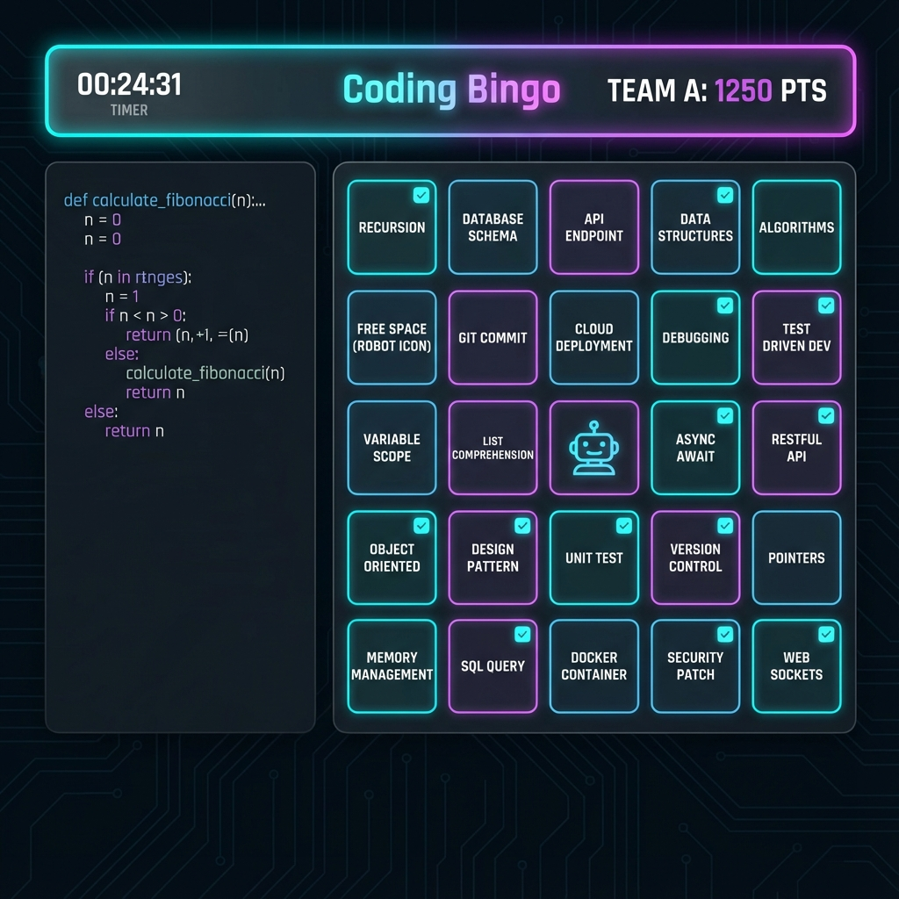
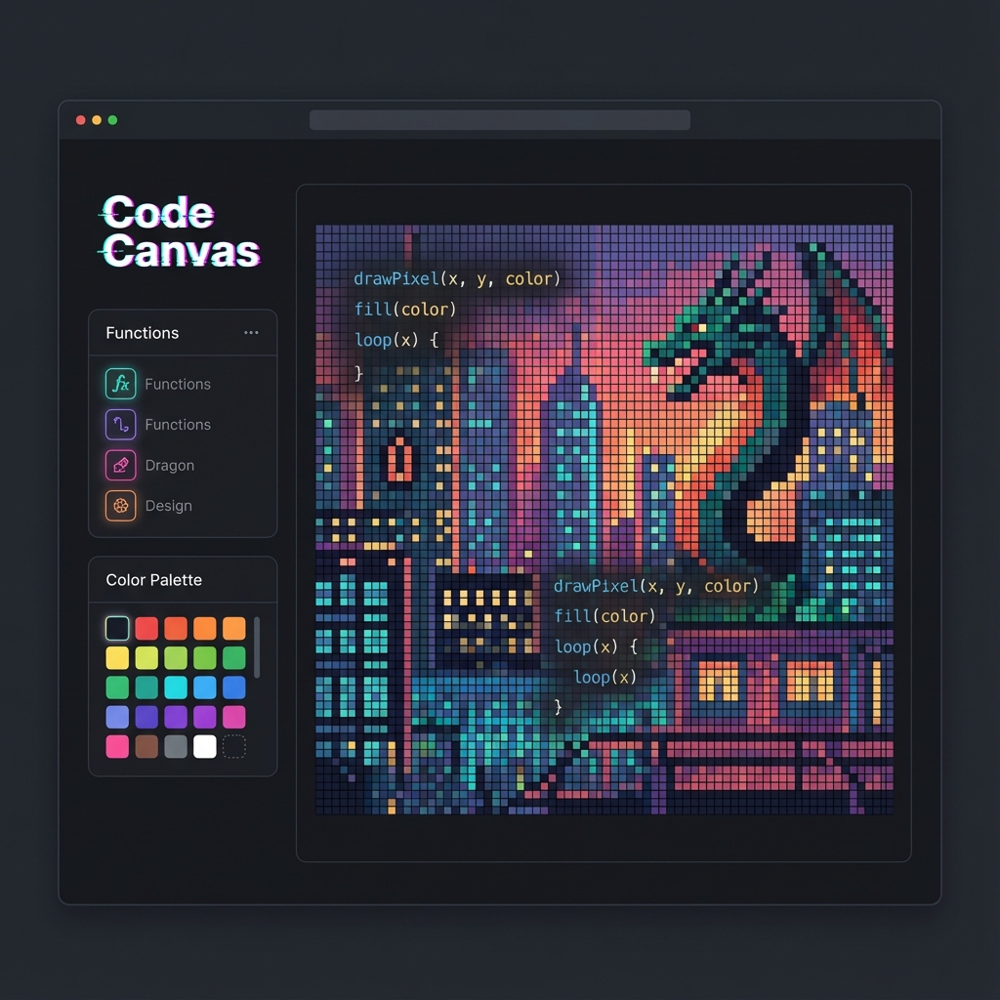
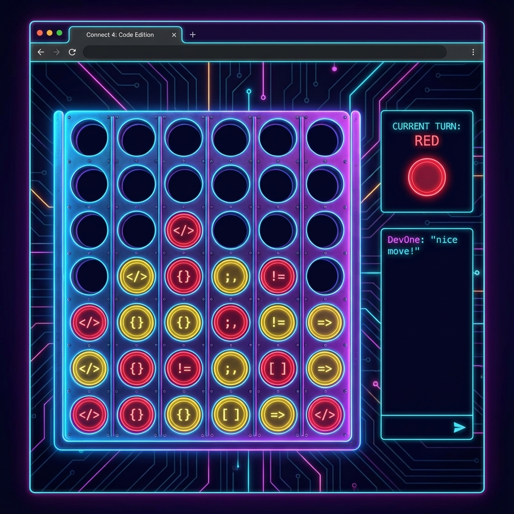
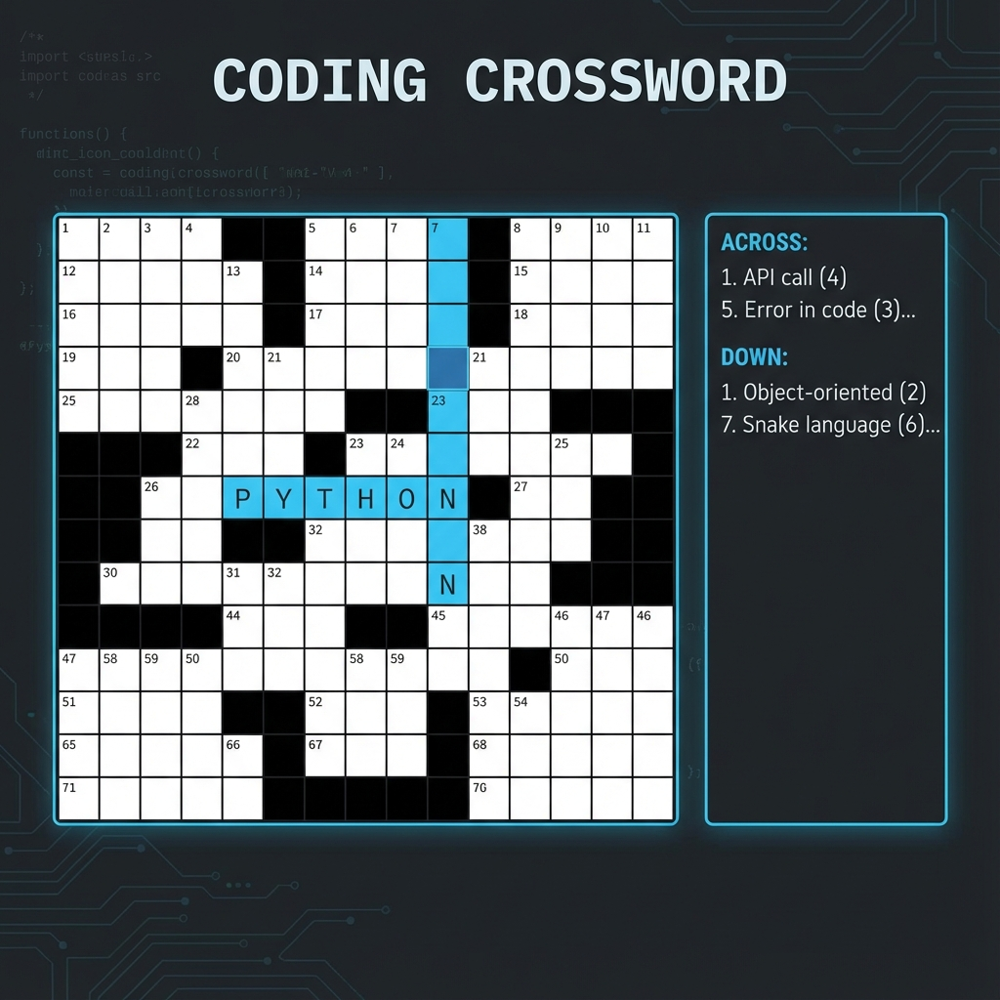

# 🎮 Coding Bingo Platform - Complete Guide

Welcome to the **Coding Bingo Platform**, a comprehensive suite of multiplayer coding games designed to test your programming skills, logic, and teamwork. This guide provides an overview of all available game modes and features.



## 🌟 Introduction

The Coding Bingo Platform is a real-time multiplayer environment where teams compete in various coding-themed challenges. Whether you're debugging code against the clock, solving logic puzzles, or competing in a classic game of Connect 4 with a twist, there's something for every coder.

## 🕹️ Game Modes

### 1. Coding Bingo (Flagship Game)
The core experience of the platform. Teams solve coding problems to claim spots on a 5x5 grid.
- **Objective:** Complete a row, column, or diagonal (Bingo) or fill the entire grid.
- **Mechanics:** Correct answers fill random spots. "Fake" questions test your knowledge without filling the grid.
- **Visuals:** Split-screen view with code editor and live bingo grid.


### 2. Speed Coding Race
A high-octane race against other teams to fix buggy code.
- **Objective:** Fix syntax and logic errors in the provided code snippets as fast as possible.
- **Mechanics:** Real-time progress bar shows your standing against other teams.
- **Visuals:** Dark-themed editor with diff-view capabilities and live race status.


### 3. Code Canvas
Unleash your creativity by drawing with code.
- **Objective:** Create pixel art or patterns using code commands.
- **Mechanics:** Use a custom API to draw on the canvas. Best designs win!
- **Visuals:** Large canvas area with a command palette and color picker.



### 4. Memory Match
Test your memory and code knowledge.
- **Objective:** Match pairs of cards. Pairs can be `Code <-> Output`, `Concept <-> Definition`, or identical symbols.
- **Mechanics:** Turn-based or time-attack modes.
- **Visuals:** Grid of flip-cards with coding symbols.


### 5. Connect 4 (Coder's Edition)
The classic strategy game reimagined.
- **Objective:** Connect 4 discs in a row.
- **Mechanics:** To drop a disc, you must answer a quick coding question correctly.
- **Visuals:** Vertical game board with neon-styled discs.



### 6. Sudoku
Logic puzzle for the analytical mind.
- **Objective:** Fill the 9x9 grid so that each column, row, and 3x3 box contains all digits from 1 to 9.
- **Mechanics:** Standard Sudoku rules, with a coding twist (hexadecimal mode available).
- **Visuals:** Clean, minimalist grid with helper tools.


### 7. Coding Crossword
Test your terminology.
- **Objective:** Fill the crossword grid with programming terms based on clues.
- **Mechanics:** Clues cover languages, algorithms, and computer science history.
- **Visuals:** Classic crossword layout with a modern dark theme.



### 8. Tech Quiz & Puzzle Hunt
- **Tech Quiz:** Fast-paced multiple choice questions to test broad knowledge.
- **Puzzle Hunt:** A series of cryptic logic puzzles and riddles that require out-of-the-box thinking.

## 🛠️ Admin Panel Guide

The Admin Panel is the control center for the platform.

1.  **Access:** Navigate to `/admin`.
2.  **Create Room:** Enter a unique Room Code, Title, and select the Game Type.
3.  **Manage Questions:** Upload questions via CSV or add them manually.
4.  **Control Game:** Start, pause, or force-end games. Monitor the live leaderboard.

## 🚀 Installation & Setup

### Prerequisites
- Node.js (v18 or higher)
- PostgreSQL database (local or cloud like [Neon](https://neon.tech))
- pnpm (recommended) or npm

### Quick Start

1. **Clone the repository**
```bash
git clone https://github.com/HEETMEHTA18/Coding-Bingo-Platform.git
cd Coding-Bingo-Platform
```

2. **Install dependencies**
```bash
pnpm install
# or
npm install
```

3. **Setup Environment Variables**
```bash
# Copy the example file
cp .env.example .env

# Edit .env and fill in your values:
# - DATABASE_URL: Your PostgreSQL connection string
# - ADMIN_SECRET: Generate a secure random string
# - JUDGE0_API_KEY: Get from RapidAPI (optional, for online compiler)
```

4. **Setup Database**
```bash
# Run migrations
pnpm run db:push
# or
npm run db:push
```

5. **Start Development Server**
```bash
pnpm run dev
# or
npm run dev
```

6. **Access the Platform**
- Main App: `http://localhost:5173`
- Admin Panel: `http://localhost:5173/admin`
- Super Admin: `http://localhost:5173/superadmin`
  - Default credentials: `admin` / `SUPERADMIN@123`

### Environment Variables

| Variable | Description | Required |
|----------|-------------|----------|
| `DATABASE_URL` | PostgreSQL connection string | Yes |
| `ADMIN_SECRET` | Secret key for admin authentication | Yes |
| `JUDGE0_API_KEY` | API key for Judge0 compiler (from RapidAPI) | No |
| `PORT` | Server port (default: 8080) | No |

### Deployment

For production deployment to platforms like Railway, Vercel, or VPS, ensure:
- Set all environment variables in your hosting platform
- Use a production PostgreSQL database
- Set `NODE_ENV=production`

---

*Built with ❤️ for the developer community.*
